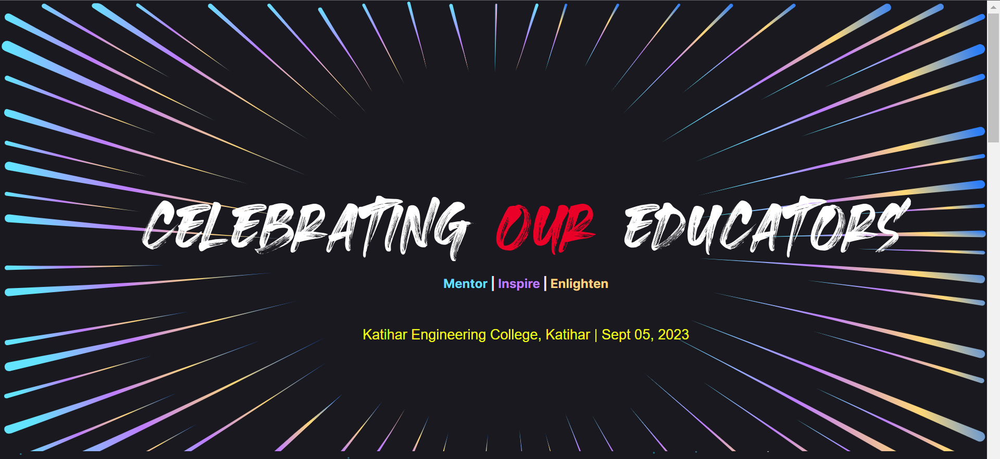

This is a [Next.js](https://nextjs.org/) project bootstrapped with [`create-next-app`](https://github.com/vercel/next.js/tree/canary/packages/create-next-app).

A Next Js based webapp for Inviting Teachers on the occassion Teacher's Day. The webapp uses [Dynamic Routes](https://nextjs.org/docs/pages/building-your-application/routing/dynamic-routes) for loading the personalized content for each invitee.TechStack used:

- 🚀 [**Next.js 13**](https://nextjs.org/blog/next-13)
- 🍓 [**JavaScript**](https://www.javascript.com/)
- ⚙️ [**Tailwind CSS 3**](https://tailwindcss.com/) - A utility-first CSS framework
- ⚙️ [**shadcn-ui**](https://ui.shadcn.com/) - An awesome component library
- 📏 [**ESLint**](https://nextjs.org/docs/app/building-your-application/configuring/eslint) — Pluggable JavaScript linter
- 🗂 **Absolute import** - Import folders and files using the `@` prefix

### Screenshot



### Requirements

- Node.js 16+

### Getting started

Run the following command on your local environment:

```shell
git clone https://github.com/kgaurav152/kec-teacher-day-website.git

cd kec-teacher-day-website

npm install
# or
yarn install
# or
pnpm install
```

Then, you can run locally in development mode with live reload:

```bash
npm run dev
# or
yarn dev
# or
pnpm dev
```

Open [http://localhost:3000](http://localhost:3000) with your favorite browser to see your project.

You can start editing the page by modifying `App/page.jsx`. The page auto-updates as you edit the file.

This project uses [`next/font`](https://nextjs.org/docs/basic-features/font-optimization) to automatically optimize and load Inter, a custom Google Font.

## Learn More

To learn more about Next.js, take a look at the following resources:

- [Next.js Documentation](https://nextjs.org/docs) - learn about Next.js features and API.
- [Learn Next.js](https://nextjs.org/learn) - an interactive Next.js tutorial.

You can check out [the Next.js GitHub repository](https://github.com/vercel/next.js/) - your feedback and contributions are welcome!
